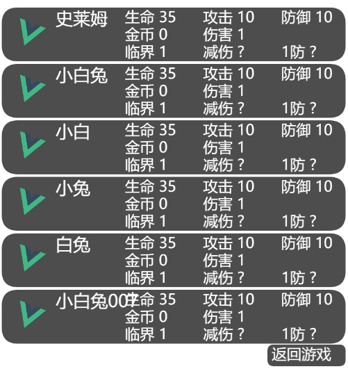

## vue-pixi-renderer
使用vue的结构来渲染pixi页面。
[`Vue.js`](https://vuejs.org)   
[`PIXI.js`](https://pixijs.io)

<!-- TOC -->

- [vue-pixi-renderer](#vue-pixi-renderer)
- [使用说明](#%e4%bd%bf%e7%94%a8%e8%af%b4%e6%98%8e)
  - [安装使用](#%e5%ae%89%e8%a3%85%e4%bd%bf%e7%94%a8)
  - [基本介绍](#%e5%9f%ba%e6%9c%ac%e4%bb%8b%e7%bb%8d)
    - [vroot](#vroot)
    - [container](#container)
    - [vtext](#vtext)
    - [sprite](#sprite)
    - [zone](#zone)
    - [graphics](#graphics)
  - [class的使用](#class%e7%9a%84%e4%bd%bf%e7%94%a8)
  - [fit的使用：自适应大小](#fit%e7%9a%84%e4%bd%bf%e7%94%a8%e8%87%aa%e9%80%82%e5%ba%94%e5%a4%a7%e5%b0%8f)
  - [event的使用](#event%e7%9a%84%e4%bd%bf%e7%94%a8)
  - [function 使用](#function-%e4%bd%bf%e7%94%a8)
    - [function 中可使用的一些函数](#function-%e4%b8%ad%e5%8f%af%e4%bd%bf%e7%94%a8%e7%9a%84%e4%b8%80%e4%ba%9b%e5%87%bd%e6%95%b0)
  - [简单实例](#%e7%ae%80%e5%8d%95%e5%ae%9e%e4%be%8b)
  - [示例网站](#%e7%a4%ba%e4%be%8b%e7%bd%91%e7%ab%99)
  - [工程相关](#%e5%b7%a5%e7%a8%8b%e7%9b%b8%e5%85%b3)

<!-- /TOC -->

## 使用说明

**目前有很大不足，极有可能出现各种各样的bug！**

**目前有较多bug**

虚拟Node更改自[`simple-virtual-dom`](https://github.com/livoras/simple-virtual-dom)。

每次该组件重新渲染时，重新生成Node Tree，然后diff、patch。

动画请在函数中直接控制node，而不是使用Vue传递一个不断变化的属性。(每次重新render都要遍历虚拟Node树，耗时较大);

其余皆为pixi属性，详情见[`pixiJS API DOCUMENT`](http://pixijs.download/release/docs/index.html)

### 安装使用

```javascript
npm install -save vue-pixi-renderer
```

```javascript
import Vue from 'vue'
import VuePixiRenderer from 'vue-pixi-renderer'

Vue.use(VuePIXIRenderer);
```


### 基本介绍

1. `<vroot></vroot>` 

 以它为根部建立虚拟node Tree

2. `<container></container>` 

 一个容器。(除root外的任何元素都可作为容器) 

 创建一个相对坐标系。

3. `<vtext>Text</vtext>` 

 显示字体

4. `<sprite>{src or id}</sprite>` 

 显示图片

5. `<zone></zone>` 

 创建一个区域

6. `<graphics></graphics>`

 使用pixi.Graphics创建自定义的绘制，需使用init方法

除`<vroot></vroot>` 外的所有元素均可使用pixiAPI对应的各项数据

​	比如 `<vtext :x=100 :y=100 :anchor='{x: 0.5, y: 0.5}'>Text</vtext>` 

#### vroot

 ```jsx
<template>
	<vroot
:stage='$stage' 
    在此传入stage，视为要渲染到的Container
    如果没有传入stage，则应提供创建pixi Application的参数，如width，height
    具体参数列表 http://pixijs.download/release/docs/PIXI.Application.html
:texture='$texture' 
   在此传入texture，sprite标签中的id则从此对象里寻找
    {id1: Texture}    <sprite>id1</sprite>
	{id2: [] of Texture}    <sprite :time='500'>id2</sprite> 
		则应表现为500ms一帧的AnimateSprite
	如果没有传入参数，则<sprite>./img/logo.png</sprite>视作地址src，将会尝试以该地址加载图片
           >
    </vroot>
</template>
<script>
export default {
  created() {
     // 不应在data中赋值，避免生成响应式数据
    this.$stage = window.app.stage;
    this.$texture = myTextureObject
  },
};
</script>
 ```

#### container

```jsx
<container :x=100 :y=100 :anchor='{x: 0.5, y: 0.5}'></container>
```

#### vtext

```jsx
<vtext :style='{fill: '#ffffff', fontSize:'17px'}'></vtext>
```

具体style属性列表请访问

 http://pixijs.download/release/docs/PIXI.TextStyle.html 

#### sprite

sprite的src请填public里图片的路径，因为不能被解析(×)

具体是id还是src，请查看 vroot中texture值是否给出

```jsx
<sprite>src or id</sprite>
```

#### zone

```jsx
<zone
    :width=100
    :height=100
    :radius=0.2   [0~0.5]的一个值
    :fillColor='red'
    :fillAlpha=1  [0~1]
    :lineWidth=3	strokeLine的宽度
    :lineColor='blue'
    :lineAlpha=1  [0~1]
    :alignment=1	strokeLine相对zone的位置，如果为0.5线宽一半在里面，一半在外面
    				为1表明全部在外面
    >
</zone>
```

#### graphics

```jsx
<graphics
    :init='drawLine'
    >
</graphics>
<script>
    请不要写在methods里，methods里的方法会bind Vue的this
    data() {
        return {
            drawLine() {
                this.lineStyle(4, 0xFFFFFF, 1);
                this.moveTo(0, 0);
                this.lineTo(80, 50);
            }
        }
    }
</script>
```

更多绘制方法请看 http://pixijs.download/release/docs/PIXI.Graphics.html 


### class的使用

```jsx
<vtext class='status'>字体</vtext>

<script>
    data() {
        return {
            class: {
                status: {
                    class: 'font',
                    style: {
                        fontSize: '17px',
                    },
                },
                font: {
                    style: {
                        fill: '#ffffff',
                        fontFamily: 'sans-serif',
                  	},
                }
            }
        }
    }
</script>
```

class相当于一个包含所要填写属性的对象，class里面的值可以填

正常情况下，属性中的值会覆盖class对应的属性，class中的值也会覆盖掉内层引用class对应的值


### fit的使用：自适应大小

1. 以某个区域自适应大小

   ```jsx
   <vtext
        class="font"
        :fit="{zone:[x, y, width, height], ratio:[minRatio,maxRatio], 				:type="center"}"
   >哈哈哈</vtext>
   ```

   zone: 为区域的x，y，width，height

   type：为在区域的基本位置 

   ​		Array： [dx，dy] dx,dy均为0~1中的一个值，表明在区域的位置

   ​		String:  center, left, right, top, bottom

   ratio:  放大的比例

   ​		number ：锁定放大比例

   ​		Array:  [minRatio, maxRatio] 最小放大比例，最大放大比例

   2. 以parent尺寸，自适应大小

```jsx
<zone class="color" :width=80 :height=25>
    <vtext class="status" fit="parent">
        fit="parent": 尝试按照parent的大小resize
        :fit="{zone:'parent', ratio:[minRatio,maxRatio], type:'center'}"
      	一些文字
    </vtext>
</zone>
```

### event的使用

```jsx
<zone
        v-for="(enemy, index) in enemys"
        :key="enemy.name"
        :y="3 + (lineHeight+3)*index"
        :$index='index'
        :class="['bg', { select: index === select}]"
        @pointerdown="clickIndex"
      >
			...
      </zone>
methods: {
    clickIndex(event) {
        console.log(`you click ${event.target.$index}`)
      this.select = event.target.$index;
    },
}
```

​    为什么要弄一个$index， 因为点击需要精确到点了哪一个框

​    如果仅仅`@pointertap="clickIndex(i)"`，每次重新刷新，函数都要重新更新，因为传的是重新生成的

   一个匿名函数，弄一个$index，会直接在pixi属性元素中添加$index属性($确保不会覆盖正常属性)，

​    这样在点击事件中，event.target.$index 即可访问到index


具体event列表

 http://pixijs.download/release/docs/PIXI.Sprite.html#event:click 

左侧events栏

pointer是兼容mouse和touch的

​	pointerdown 按下

​	pointerup  松起

​	pointermove 移动

​	pointertap  点击

​	pointerout   移出该元素


### function 使用

:update 传入的方法 每帧执行一次，每秒60帧

:init 传入的方法 在生成该pixi元素时执行

:start 传入的方法，在pixi元素被加入时执行

**注意，请不要写在methods里，methods里的方法会bind Vue的this**

```jsx
<sprite class="icon" :update="rotate">./img/logo</sprite>
<script>
    请不要写在methods里，methods里的方法会bind Vue的this
    data() {
        return {
          rotate() {
        	this.angle += 1;
          },
        }
    }
</script>
```

#### function 中可使用的一些函数

```javascript
this.loop(from, to, time, repeat = Infinity)
```

```jsx
<sprite
        :class="logo"
        :x=208 :y=208
        :anchor='{x: 0.5,y:0.5}'
        :init='loop'
 >./img/logo.png</sprite>
<script>
    data() {
        return {
          loop() {
            this.loop({
              alpha: 0,
            }, {
              alpha: 1,
            }, 1000);
          },
        }
    }
</script>
效果为透明度一直改变
```


```javascript
this.changeTo()
参数为2 个 为 to，time
参数为3个 to，rime， callback
		from，to， callback
参数为4个 from，to。time，callback
```

### 简单实例

```jsx
<template>
  <vroot class='app' :width='width' :height='height'>
    <zone 
      :x=20 
      :y=180 
      :width=100 
      :height=100 
      :radius=0.3 
      :fillAlpha=0.3
      :lineWidth=5
      lineColor="blue"
      :lineAlpha=0.3
      @pointertap='clickMe'
    >
      <vtext class='text' fit='parent'>{{ button }}</vtext>
    </zone>
    <vtext class='text' :start='show'>{{ str }}</vtext>
    <sprite class="logo" :update='rotate' :start='loop'>{{ logo }}</sprite>
  </vroot>
</template>

<script>
import logo from './assets/logo.png'
export default {
  name: 'App',
  data() {
    const width = 300;
    const height = 300;
    return {
      logo,
      width,
      height,
      str: 'vue-pixi-renderer',
      button: 'Click Me!',
      class: {
        logo: {
          x: width / 2,
          y: height / 2,
          anchor: {
            x: 0.5,
            y: 0.5,
          }
        },
        text: {
          style: {
            fontSize: '22px',
            fill: 'red',
            fontFamily: 'sans-serif',
          }
        },
      },
      show() {
        this.changeTo({
          x: 300,
          y: 300,
        },{
          x: 0,
          y: 0,
        }, 1000);
      },
      rotate() {
        this.angle += 1;
      },
      loop() {
        this.changeTo({
          x: 0,
        }, {
          x: width / 2,
        }, 1000);
        this.loop({
          alpha: 0,
        }, {
          alpha: 1,
        }, 1000);
      },
    }
  },
  methods: {
    clickVue() {
      this.str = 'you click Vue';
    },
    clickMe() {
      this.button = 'you click me QAQ';
      setTimeout(() => {
        this.button = 'Click Me!'
      }, 1000);
    }
  }
}
</script>

```




### [示例网站](https://www.voderl.cn/test/)

### 工程相关

index.js	- vue插件的导出

|— components    

​			vue基本组件，functional组件，和 虚拟Tree的实例

​			—— vroot 为基本组件，附带一个Tree的实例

​			—— 其余组件均为functional 组件

|——lib

​			——diff.js  - 虚拟node树的diff

​			——index.js - 整体模块的导出

​			——node.js - 虚拟Node的创建及渲染  以及从functional的参数h，context中创建node的方法

​			——nodes.js	-	 pixi.js基本元素的包装，增加的一些方法

​			—— patch.js - 虚拟node树的patch

​			—— Render.js  - 又一层包装，对一些参数的处理成nodes.js对应元素的参数，渲染Node由此处

​			—— utils.js - 一些utils函数，比如颜色，deep assign， clone